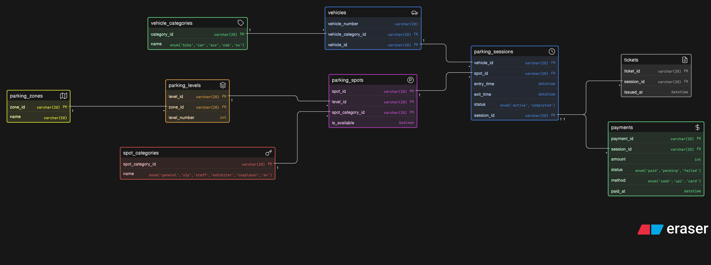

# Parking Management Database

This repository contains the SQL schema for a parking management system.

## Overview

- `Comic_con.sql` contains the database schema definitions.
- `image.png` shows the ER diagram for the schema.

## ER Diagram

## Usage

Open `Comic_con.sql` in your SQL editor or import it into your database management tool to create the schema.
